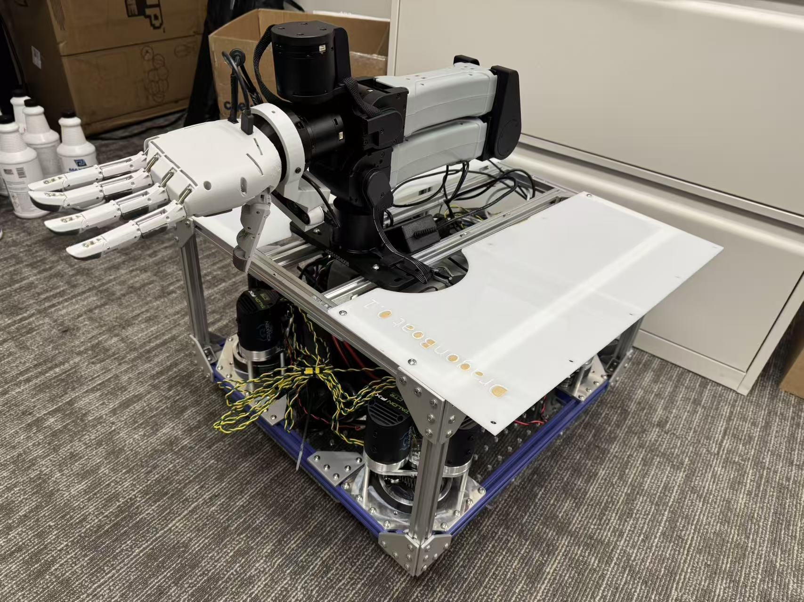

# TidyVerse

**TidyVerse** is a research project on long-horizon household manipulation with dexterous mobile robots.  
The goal is to enable robots with multi-finger hands and a mobile base to perform room-scale tidying tasks—such as arranging shoes and folding clothes—by learning from unstructured human videos.

  

## Overview

TidyVerse focuses on three key challenges:
- **Long-horizon tasks** involving multiple objects and sequential subgoals
- **Dexterous manipulation** with multi-finger robot hands
- **Human video supervision** without paired human–robot demonstrations

We introduce **TidyMimic++**, an intent-level imitation framework that distills object-centric task structure from human videos and grounds it in robot execution.

## Tasks

Example tasks in TidyVerse include:
- Shoe arrangement and alignment
- Cloth flattening and folding
- Room-scale cleanup with navigation and manipulation

## Status

This repository contains research code and assets for an ongoing project.  
More details, datasets, and code will be released upon publication.

## License

For research use only.
