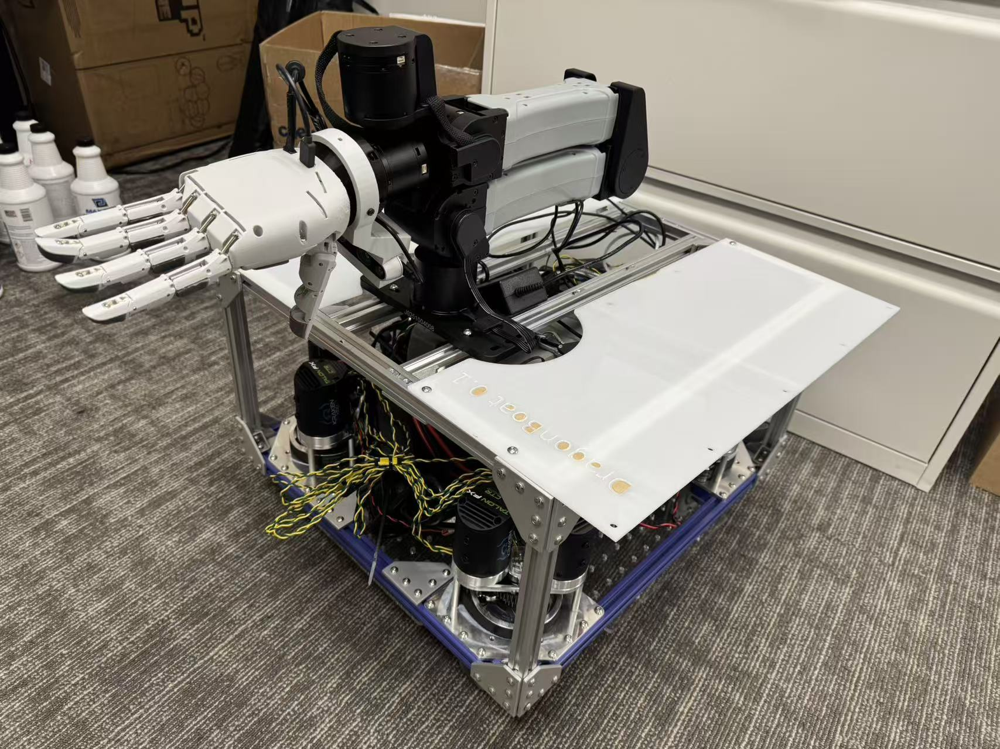

# TidyVerse

**TidyVerse** is a research project on long-horizon household manipulation with dexterous mobile robots.  
The goal is to enable robots with multi-finger hands and a mobile base to perform room-scale tidying tasks—such as arranging shoes and folding clothes—by learning from unstructured human videos.

<p align="center">
  
</p>

## Demos

### Shoes arrangement in the garage

<p align="center">
  <video src="static/assets/shoes_arrangement_garage.mp4" controls width="80%"></video>
</p>

### Slides

[TidyVerse Project Slides](https://docs.google.com/presentation/d/1R_DfAqw_C3YW7VPrh1crhGFvS28RbNxURN68d7ljS0Y/edit?usp=sharing)

## Documentation

For a deeper understanding of the system, see the [`docs/`](docs/) folder:
- [`docs/dragonbot_control_architecture.md`](docs/dragonbot_control_architecture.md) — full control stack architecture
- [`docs/teleop_testing_guide.md`](docs/teleop_testing_guide.md) — step-by-step teleoperation testing guide

## Robot Platform

### Dragonbot v0.2

Dragonbot v0.2 is our custom dexterous mobile manipulation platform combining a holonomic base, a YAM 6-DOF arm, and an Aero Hand Open dexterous hand.

URDF models and MuJoCo scene files for visualization and simulation are available in [`simulation/`](simulation/):
- `simulation/dragonbot/` — full Dragonbot scene
- `simulation/yam_with_hand/` — YAM arm + hand combined scene
- `simulation/assets/` — STL meshes for the base, arm, and gripper

### ROS2 Full-Stack Controls

A complete ROS2-based communication and control stack is available in [`ros2/`](ros2/), covering:
- **Base**: SpaceMouse teleoperation (`dragonbot_teleop`)
- **Arm**: Quest 3 wrist-pose IK teleoperation (`dragonbot_teleop`)
- **Hand**: Quest 3 dexterous retargeting to 16-DOF joint commands (`dragonbot_teleop`)
- **Hardware drivers**: Aero Hand Open node and message types (`aero_hand_open`, `aero_hand_open_msgs`)
- **Simulation viewers**: MuJoCo passive viewers for base + arm + hand

The dexterous hand hardware and ROS2 drivers are based on **[TetherIA/aero-hand-open](https://github.com/TetherIA/aero-hand-open)**.
We thank the TetherIA team for open-sourcing the Aero Hand Open platform.

### GR00T-N1.6 Control Policy

We are adapting **NVIDIA GR00T-N1.6** as the visuomotor control policy for Dragonbot.
Our ongoing fork with Dragonbot embodiment configs, a ROS2 policy bridge, and deployment guides is available at:

👉 **[dragonlong/Isaac-GR00T](https://github.com/dragonlong/Isaac-GR00T)** (see [`third_party/Isaac-GR00T/`](third_party/Isaac-GR00T/))

Key additions in the fork:
- `examples/tidyverse-hand/` — ROS2 policy bridge, FastDDS config, deployment guide
- `gr00t/configs/data/embodiment_configs.py` — Dragonbot embodiment definition
- `dragonbot_finetune.md` — step-by-step fine-tuning guide

## Overview

TidyVerse focuses on three key challenges:
- **Long-horizon tasks** involving multiple objects and sequential subgoals
- **Dexterous manipulation** with multi-finger robot hands
- **Human video supervision** without paired human–robot demonstrations

We introduce **TidyMimic++**, an intent-level imitation framework that distills object-centric task structure from human videos and grounds it in robot execution.

## Tasks

Example tasks in TidyVerse include:
- Shoe arrangement and alignment
- Cloth flattening and folding
- Room-scale cleanup with navigation and manipulation

## Progress & Roadmap — v0.2 Pre-release

### ✅ Done

- **Dragonbot v0.2 hardware platform** — holonomic base + YAM 6-DOF arm + Aero Hand Open (16-DOF dexterous hand)
- **Simulation models** — MuJoCo URDF/XML scenes for Dragonbot, YAM+hand, and Stanford TidyBot in [`simulation/`](simulation/)
- **ROS2 full-stack controls** — SpaceMouse base teleoperation, Quest 3 wrist-pose IK arm teleoperation, Quest 3 hand retargeting; all in [`ros2/`](ros2/)
- **Data pipeline** — rosbag/MCAP → LeRobot dataset conversion; sample: [`littledragon/evan_house_split_1g_lerobot_v3`](https://huggingface.co/datasets/littledragon/evan_house_split_1g_lerobot_v3)
- **GR00T-N1.6 integration** — Dragonbot embodiment config, ROS2 policy bridge, and deployment guide in [`third_party/Isaac-GR00T/examples/tidyverse-hand/`](third_party/Isaac-GR00T/examples/tidyverse-hand/)
- **pi-0.5 fine-tuning + serving (LIBERO)** — [W&B logs](https://wandb.ai/lxiaol9/openpi?nw=nwuserlxiaol9)

### 🔧 In progress

- **GR00T-N1.6 fine-tuning on Dragonbot data** — see [`third_party/Isaac-GR00T/dragonbot_finetune.md`](third_party/Isaac-GR00T/dragonbot_finetune.md) for instructions *(coming soon)*
- **pi-0.5 SFT with adaptive hand grasping**

### 🧪 Planned

- Co-training with human egocentric data (VITRA) + EgoDex
- End-to-end spatial grounding + sequential task execution

---

### pi-0.5 fine-tuning details (LIBERO)
- **Logs**: [W&B run group](https://wandb.ai/lxiaol9/openpi?nw=nwuserlxiaol9)

```shell
# (in your openpi checkout)
OPENPI_DIR=/path/to/openpi
cd "$OPENPI_DIR"

# 1) compute mean/std used for normalization
uv run scripts/compute_norm_stats.py --config-name pi05_libero

# 2) launch training
XLA_PYTHON_CLIENT_MEM_FRACTION=0.9 \
  uv run scripts/train.py pi05_libero --exp-name=libero_ft --overwrite

# 3) build a serving image
docker build -t openpi_server -f scripts/docker/serve_policy.Dockerfile .

# 4) run a dev container (adjust volumes as needed)
export OPENPI_DATA_HOME="${OPENPI_DATA_HOME:-$HOME/.cache/openpi}"
mkdir -p "$OPENPI_DATA_HOME"

docker run -d \
  --name openpi_dev_session \
  --gpus all \
  --network host \
  --shm-size=24G \
  -v "$PWD":/app \
  -v "${OPENPI_DATA_HOME}":/openpi_assets \
  -e OPENPI_DATA_HOME=/openpi_assets \
  openpi_server \
  tail -f /dev/null

# 5) run a simple client
docker exec -it openpi_dev_session /bin/bash
uv run python examples/simple_client/main.py --host localhost --port 8000
```

### 🔧 In progress: pi-0.5 SFT with adaptive hand grasping
- **Step 1 (data pipeline)**: rosbag/MCAP → LeRobot dataset (sample: [`littledragon/evan_house_split_1g_lerobot_v3`](https://huggingface.co/datasets/littledragon/evan_house_split_1g_lerobot_v3))

```shell
# TODO: fill in with the exact conversion command for your data source.
# Example placeholders:
# python tools/convert_mcap_to_lerobot.py --input /path/to/*.mcap --output /path/to/dataset_root
# lerobot-dataset-viz --repo-id <name> --root /path/to/dataset_root --episode-index 0 --video-backend pyav
```

### 🧪 Planned: co-training with human egocentric data (VITRA) + EgoDex

### 🧭 Planned: end-to-end spatial grounding + sequential task execution

## License

For research use only.
